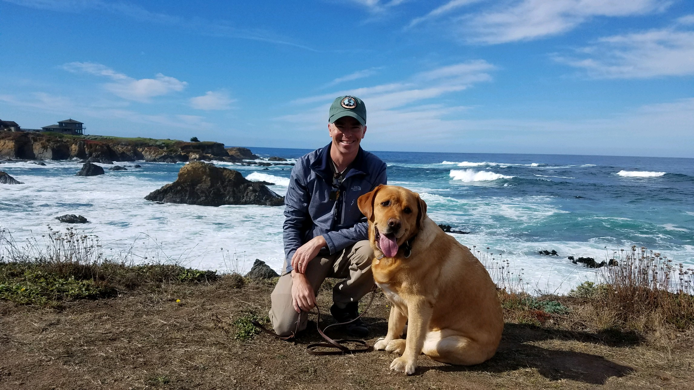

**The Nomad:** "Sleep doctor, have you ever had anyone cured of sleep apnea?" 
**Sleep Doctor:** "No, we would have to cut out your tongue."

**UPDATE: 4/1/2019**

**I no longer need to use the CPAP machine! I am only using an oral appliance (mouth piece). I just completed an in the lab sleep study. The result? AHI = 1/hr!**

Breakdown of events:

- Obstructive Apneas = 0
- Hyponeas = 1
- Clear Airway = 1
- RERA = 1

Diagnosed with severe sleep apnea in 2010 with an AHI of 33, I have been trying to prove my sleep doctor wrong while keeping my tongue! Currently, I still have sleep apnea and my tongue! This site is a collection of the many things I have tried since 2010 to improve my sleep apnea and sleep in general. I currently use a cpap machine along with a mouth piece. Hopefully by sharing, we can collectively improve all of our sleep conditions.

Todd 
 
The Sleep Nomad

