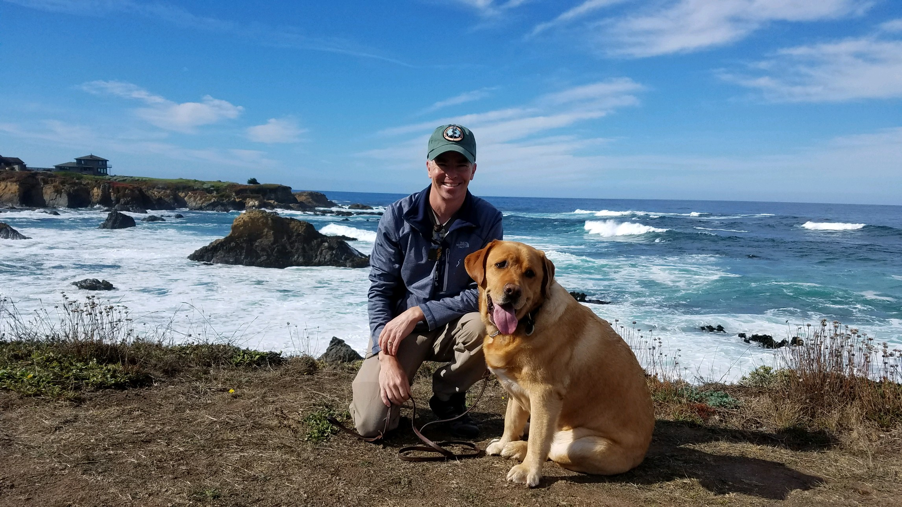

**The Nomad:** "Sleep doctor, have you ever had anyone cured of sleep apnea?" 
**Sleep Doctor:** "No, we would have to cut out your tongue."

Diagnosed with severe sleep apnea in 2010 with an AHI of 33, I have been trying to prove my sleep doctor wrong while keeping my tongue! Currently, I still have sleep apnea and my tongue! This site is a collection of the many things I have tried since 2010 to improve my sleep apnea and sleep in general. I currently use a cpap machine along with a mouth piece. Hopefully by sharing, we can collectively improve all of our sleep conditions. Please [contact](/contact/) me at thesleepnomad.com/contact.

Currently I work in the software industry doing web development. In my spare time I enjoy coffee, exercise, hiking outdoors with my dog and wife.

Todd Polasek  
The Sleep Nomad

