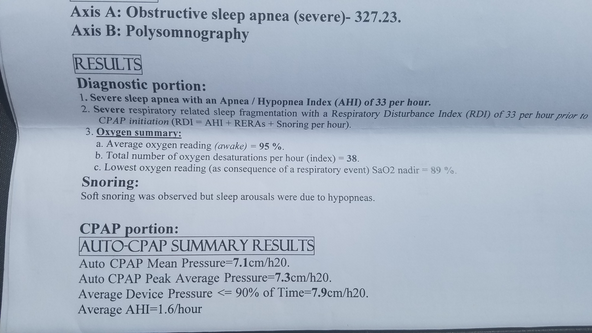
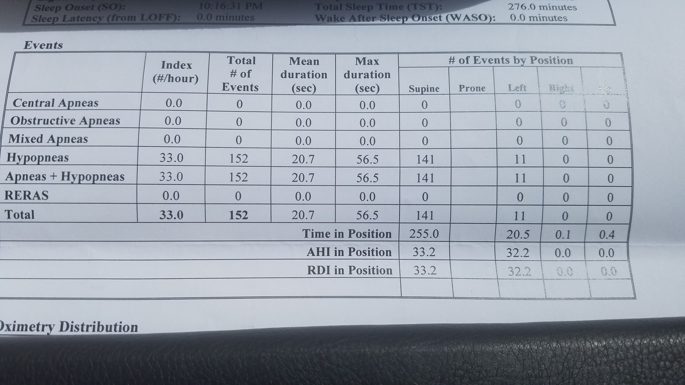
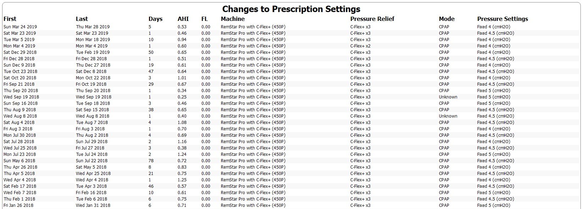
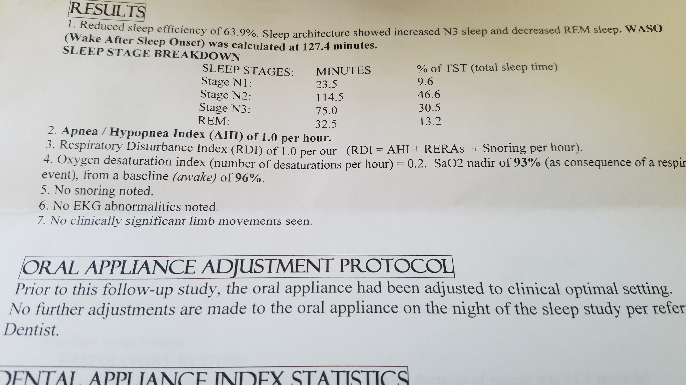
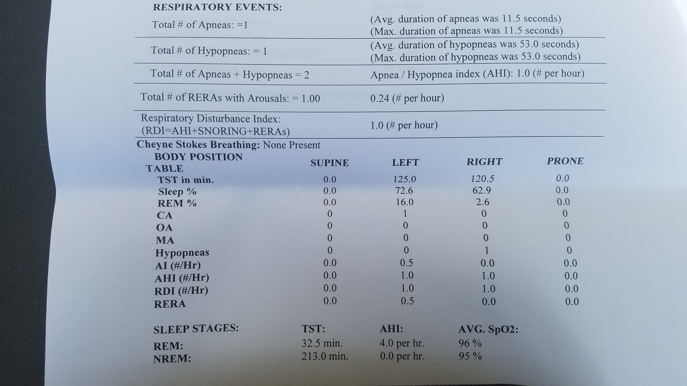

Posted: April 13, 2019
##Can Sleep Apnea Be Reversed? I think the answer is yes.
I think this post will demonstrate that sleep apnea on some level is reversible. This is not to say I think I have "cured" my sleep apnea. I haven't done that..yet. But I certainly think that my results over the past year have shown that my sleep apnea has reversed its severity. This post is meant to give encouragement and to show that reversing sleep apnea can be done at some level. I am not special in any way. So if I can do it, then everyone has the potential to do it too. Including you. I think it starts with just believing that its possible. Many of us, including me, have been told its not possible. My hope with this post is to show that it is possible. So here are my results and I will let you be your own judge.

##My sleep study nine years ago...

Below is a picture of my first sleep study nine years ago when I was diagnosed with sleep apnea. As you can see, it was pretty bad. I was diagnosed with severe sleep apnea with an AHI of 33/hour. I was having 38 desaturations per hour! What is also remarkable is that even with a CPAP machine at a pressure of 8, I was still having 1.6 events an hour.

###Total number of events 152!
Below you can see that I had 152 events during my initial sleep study. The point here is to show you that I did have pretty bad sleep apnea. The amazing thing is that I didn't believe I had sleep apnea prior to this sleep study. It is remarkable what we can sleep through.

##Oral Appliance about 3 years into having sleep apnea.
About three years after getting diagnosed with sleep apnea, I got an oral appliance in the hopes that it would be enough to get off my cpap machine. It was not enough as I woke up with bad headaches when trying to use it instead of the machine. I was afraid that if I didn't keep using it, my teeth would shift and it might become useless. So I started wearing it with my CPAP machine at night. It did allow me to reduce my pressure. As I look back at my sleepy head data, the last time I had my machine set at a pressure of 8 was June of 2015. Ever since I started using the oral appliance, I have been trying to get off the machine.

##Making progress the last year.
I am always hesitant to post numbers because they don't reflect how you feel in the morning. This is especially true for averages like below. For me, anything above an AHI number of 1.0 on my machine makes me feel tired and draggy. Below is a picture of my cpap pressure changes for the last year or so. It is kind of hard to make much out of it. A few things to note though. Back as early as April of 2018, I attempted to sleep at a pressure of 4 only to get bonked with a spike in my AHI to 1.25. That lasted one day. As you can see it is sort of an up and down roller coaster trying to slowly reduce my pressure. By February of 2019 I was sleeping at a pressure of 4 for 50 straight days with average AHI of .65. Also note that in March of this year, I went to high altitude so I raised my pressure and I also had a spike in my AHI.

##Time for a sleep study with no machine.
I happen to go to see an E.N.T. doctor to see if something could be done about my constant congestion. When I was there, I told him that I was currently using a CPAP machine and an oral appliance together at a pressure of 4. He said that he didn't think I needed the CPAP machine any more. The only way to find out if using just the oral appliance would be safe and effective was to do a sleep study with just my oral appliance. Could I really get off the machine? I did that in March.

##Sleep Study Results.

Below is a picture of my sleep study results with just my oral appliance.

##An AHI of 1.0 with no obstructive apneas!
I have reached my goal! I am well below the 5/hr which is considered normal and no obstructive apneas using just my oral appliance. I was safe without using the machine. I am very excited as I didn't think it was going to go that well. Although when I woke up from the sleep study I was amazed that I felt ok.

##Progress without using the CPAP machine.
March 28th was the last day that I have used my CPAP machine. One thing I found out is that there is a big jump from a pressure of 4 to no machine. It doesn't sound like much but my body was so used to the machine, it had to learn how to breathe on its own again. The first week, I woke up with some headaches on some mornings. I started using an overnight Pulse Oximeter that would vibrate if my oxygen got too low. It only went off once and I was awake when it did. I did notice some drops in my oxygen overnight. The second week the headaches died off and the drops in oxygen did too. My body was regaining its ability to breathe on its own. I am now, as of April 13, sleeping with just an oral appliance with an average o2 of 96% and a low of 93%. Best yet, I am waking up from sleep feeling like I did 8 plus years ago. I feel like a normal person now. Refreshed, alert, clear headed, energetic.

##Recap and the future.
I have gone from severe sleep apnea and a CPAP pressure of 8 nine years ago to using just an oral appliance with no obstructions. I would note that I have lost some weight but unfortunately for me, being thin already, it didn't resolve my sleep apnea. I do think that it is clear that I have at least reversed the severity of my sleep apnea. I am realistic in that the possibility of needing the machine again is there. I am in uncharted territory at this point. My next goal is to see if its possible to get to the point of not needed the oral appliance either. That is bonus points though. I will go with the flow and see what happens. If I can reverse sleep apnea, I am sure many people can. We just have to be given a reason to believe its possible. I hope in some small way, this is it.

<a style="background-color:black;color:white;text-decoration:none;padding:4px 6px;font-family:-apple-system, BlinkMacSystemFont, &quot;San Francisco&quot;, &quot;Helvetica Neue&quot;, Helvetica, Ubuntu, Roboto, Noto, &quot;Segoe UI&quot;, Arial, sans-serif;font-size:12px;font-weight:bold;line-height:1.2;display:inline-block;border-radius:3px" href="https://unsplash.com/@arjabedbd?utm_medium=referral&amp;utm_campaign=photographer-credit&amp;utm_content=creditBadge" target="_blank" rel="noopener noreferrer" title="Download free do whatever you want high-resolution photos from Anisur Rahman"><svg xmlns="http://www.w3.org/2000/svg" style="height:12px;width:auto;position:relative;vertical-align:middle;top:-2px;fill:white" viewBox="0 0 32 32"><title>unsplash-logo</title><path d="M10 9V0h12v9H10zm12 5h10v18H0V14h10v9h12v-9z"></path></svg>Anisur Rahman</a>
