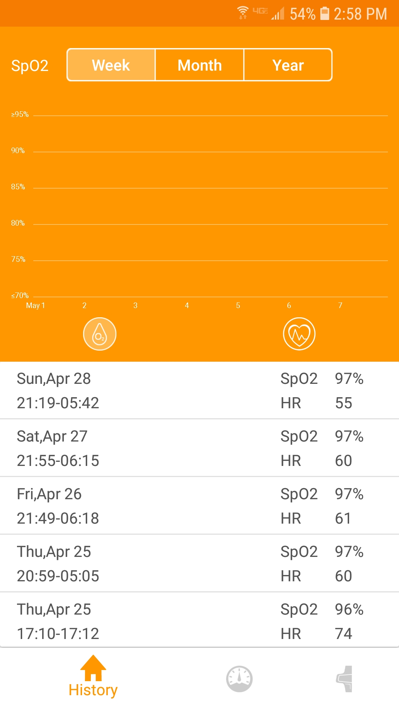

###First month in years without using a cpap machine.
_If you haven't read this post, it might be a good place to start.
[Can-Sleep-Apnea-Be-Reversed](/Can-Sleep-Apnea-Be-Reversed)._

It turns out that after using a CPAP machine for so many years, it feels a bit scary to not use it. It felt like I was doing something dangerous. I noticed I actually started to have anxiety as I was falling asleep. I worried about having apneas or desaturation events. Would I wake up before they got bad? What if I slept through them? Nobody likes that morning headache that occurs from apneas at night. The pulse oximeter became my new cpap data device and safety net. It has a vibration alarm that you can set so if your oxygen saturation drops too low, it will wake you up.

As I mentioned in my last post, I did have some headaches in the morning when I first got off the cpap machine. As the month progressed, the number of times my oxygen dropped decreased. As did the percent of oxygen. I started waking up feeling really good. Like I slept well. This really helped reduce the anxiety. I started to build confidence that I was going to be safe sleeping like this. I also had to remind myself that most people go to sleep and wake up without "data". They don't check AHI numbers in the morning with sleepyhead. They don't worry about what happened while they were sleeping. As long as you feel good when you wake up, why is there anything to worry about? I think the other piece is that as people with sleep apnea, we have been told that sleep apnea can't be reversed. But look at this. It is worth reading this paper because it outlines how it is possible after CPAP treatment that sleep apnea can be reversed. At least to some extent.

_**MADs have variable efficacy but in one study half of patients with OSA previously treated with CPAP, who were able to tolerate the MAD, no longer had clinically significant OSA for up to a month after CPAP cessation (12).**_

**Obstructive sleep apnea: can the downward spiral be reversed—a summary of John Stradling’s ATS keynote speech** July 2016
[https://www.ncbi.nlm.nih.gov/pmc/articles/PMC4990690/](https://www.ncbi.nlm.nih.gov/pmc/articles/PMC4990690/)

I had to have the mindset of a person without sleep apnea if I was going to enjoy this. Along with this, I decided to would determine how well I was doing the same way everyone else that doesn't use a cpap machine does. How do you feel? Rested? Wake up with no headache? Energetic? Happy? Ready to get going? No feeling like a nap midday? I am super happy to say that I am enjoying all of those. Its the first time in nine years I can truly say that. I decided I was just going to let go of the fear and enjoy sleeping and not worry.

###Pulse Ox data backs up how I feel!
I did have some data to back up this train of thought. This might be one of the most interesting things I have encountered during the past year with sleep apnea. When I bought this pulse ox on amazon, I read a reviewer who stated that each week she used it the number of times the low oxygen alarm went off decreased. To the point that it never when off after five weeks of using it. I think it was five weeks. I experienced this same thing! It alarm was going off at the beginning of the month. I adjusted thelow point higher, so that instead of say 91%, I would set it at 93%. As the days went by, it would never go off. I now feel safe enough that I don't wear it every night. I just wish I would have saved the screen data from the beginning of the month to show you how it was dropping then and improved now! I didn't even think of it at the time. But here is the data from my last week of wearing it.

###Steady O2 level through the night.

I wish I could show you all of the data for the month so that you could see how my pulse ox got better as the month went on. This is the only data I have. The pulse ox app is on my phone and it only saves the last five days. I decided that from now on, as long as I wake up with no headache and feel refreshed and ready to get up, I am safe without the pulse ox. If either of those to change, I will start wearing it again.

<a style="background-color:black;color:white;text-decoration:none;padding:4px 6px;font-family:-apple-system, BlinkMacSystemFont, &quot;San Francisco&quot;, &quot;Helvetica Neue&quot;, Helvetica, Ubuntu, Roboto, Noto, &quot;Segoe UI&quot;, Arial, sans-serif;font-size:12px;font-weight:bold;line-height:1.2;display:inline-block;border-radius:3px" href="https://unsplash.com/@quinoal?utm_medium=referral&amp;utm_campaign=photographer-credit&amp;utm_content=creditBadge" target="_blank" rel="noopener noreferrer" title="Download free do whatever you want high-resolution photos from Quino Al"><svg xmlns="http://www.w3.org/2000/svg" style="height:12px;width:auto;position:relative;vertical-align:middle;top:-2px;fill:white" viewBox="0 0 32 32"><title>unsplash-logo</title><path d="M10 9V0h12v9H10zm12 5h10v18H0V14h10v9h12v-9z"></path></svg>Quino Al</a>
