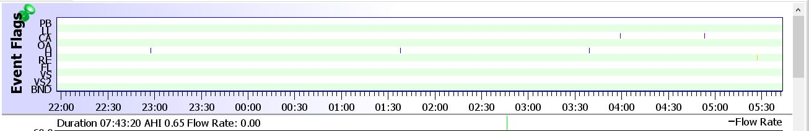
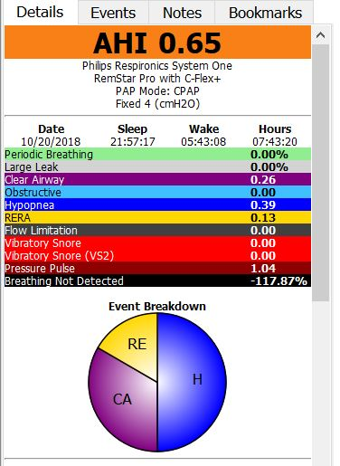

###I was wrong. You can sleep with your cpap pressure at 4.0.

I decided to post this because I did something that I didn't think was possible for me to do. In fact I wrote in [Tangible Sleep Apnea Improvement](/Tangible-Sleep-Apnea-Improvement) that I thought a pressure of 4.0 was too low to breathe on. I have tried this in the past only once that I can remember. It was a disaster then. I felt like I couldn't get enough air in my lungs fast enough. Well it turns out I was wrong. I tried it at 4.0 and to my amazement my AHI was .65 for the night. Not only that, I didn't wake up with a headache. I felt pretty damn good! I am not sure I will keep it that low. It did work but for some reason I am still not convinced the mask I am using works well at that low of a pressure.

Lately my machine has been sending a lot of "pulse pressure" checks to see if my airway is open. A lot as in 15 to 20 a night. This generally happens when my pressure is too high and my body starts to think the pressure from the machine is me actually breathing. This is a good sign I think. It is a sign that my body is starting to be more sensitive to what is happening while I am breathing.

My pressure was already at 4.5 so the only place to go is 4.0. After that it is off the machine :) Strangely it just seems like it is getting easier to breathe in general. Its as if the effort to expand my lungs is very light. My breathing seems lighter. Maybe even a bit shallower? We shall see if this continues.

##My Sleep Events

##My AHI Number

##What the numbers mean

The sleep graph shows that I had 3 partial block events and 2 clear airway events for the night. I post this as improvement because I have never been able to do this before. Like I said, I want to be very cautious in what I consider sleep apnea improvement. When you get down to 4.0 on your pressure and your AHI is stable, there is only one thing left to do. Go without the machine and just the oral appliance! I am going to see how this goes before I try that. I am not in a rush to try it until I am pretty sure its going to work out well.

##Vitamin D - Month 5 and Month 6

Where is that post?! Good point. I will be writing that up very soon. It will be a combined post for both months.

<a style="background-color:black;color:white;text-decoration:none;padding:4px 6px;font-family:-apple-system, BlinkMacSystemFont, &quot;San Francisco&quot;, &quot;Helvetica Neue&quot;, Helvetica, Ubuntu, Roboto, Noto, &quot;Segoe UI&quot;, Arial, sans-serif;font-size:12px;font-weight:bold;line-height:1.2;display:inline-block;border-radius:3px" href="https://unsplash.com/@jeremythomasphoto?utm_medium=referral&amp;utm_campaign=photographer-credit&amp;utm_content=creditBadge" target="_blank" rel="noopener noreferrer" title="Download free do whatever you want high-resolution photos from Jeremy Thomas"><svg xmlns="http://www.w3.org/2000/svg" style="height:12px;width:auto;position:relative;vertical-align:middle;top:-1px;fill:white" viewBox="0 0 32 32"><title>unsplash-logo</title><path d="M20.8 18.1c0 2.7-2.2 4.8-4.8 4.8s-4.8-2.1-4.8-4.8c0-2.7 2.2-4.8 4.8-4.8 2.7.1 4.8 2.2 4.8 4.8zm11.2-7.4v14.9c0 2.3-1.9 4.3-4.3 4.3h-23.4c-2.4 0-4.3-1.9-4.3-4.3v-15c0-2.3 1.9-4.3 4.3-4.3h3.7l.8-2.3c.4-1.1 1.7-2 2.9-2h8.6c1.2 0 2.5.9 2.9 2l.8 2.4h3.7c2.4 0 4.3 1.9 4.3 4.3zm-8.6 7.5c0-4.1-3.3-7.5-7.5-7.5-4.1 0-7.5 3.4-7.5 7.5s3.3 7.5 7.5 7.5c4.2-.1 7.5-3.4 7.5-7.5z"></path></svg>Jeremy Thomas</a>
